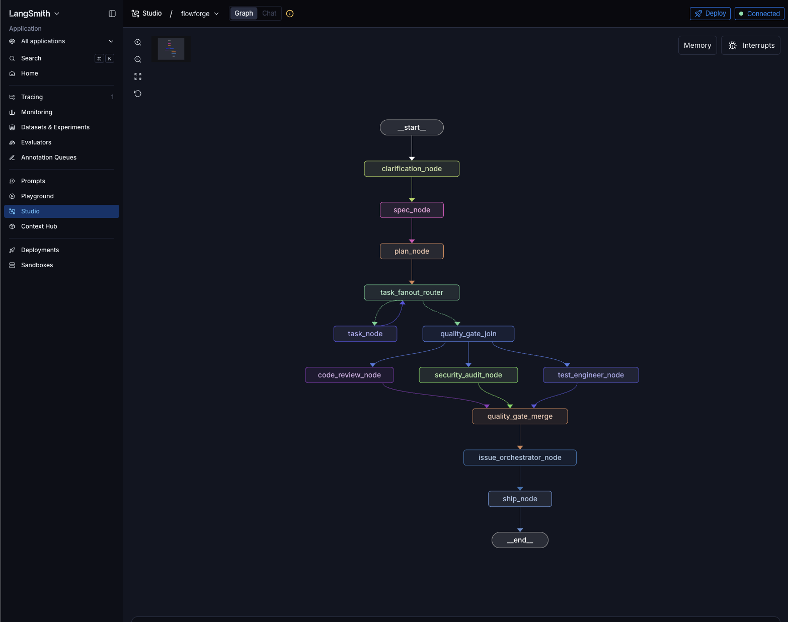

# swe-forge

[](https://pypi.org/project/swe-forge/)

Multi-agent LangGraph framework for autonomous software development.

`swe-forge` takes a one-line prompt and runs it through a 10-node graph
(clarification → spec → plan → fan-out tasks → parallel quality gates
→ issue triage → ship), commits artifacts to a brand-new GitHub repo,
filed issues for every finding, opens a pull request on a feature
branch, and pushes a tagged release when the quality gates pass.



*Live view of the FlowForge graph executing in LangGraph Studio.*

> The PyPI distribution is `swe-forge`; the Python module is `flowforge`.
> Use the `swe-forge` command after installing.

## Quick start

```bash
# 1. install from PyPI
pip install swe-forge

# 2. configure provider/model (one-time, interactive)
swe-forge setup

# 3. run a prompt — auto-creates a private GitHub repo and pushes there
swe-forge run "build tic-tac-toe web app"

# common flags
swe-forge run "<prompt>" --repo my-name      # use/create a specific repo
swe-forge run "<prompt>" --skip-github       # local-only, no remote
swe-forge run "<prompt>" --no-studio         # skip LangGraph Studio
swe-forge run "<prompt>" --no-deep-agents    # opt out of Deep Agents (deprecated, removed in v0.4)
```

Generated projects land in `~/flowforge-workspace/<slug>/` and are
pushed to `https://github.com/<you>/<slug>`. The `swe-forge` source
repo itself is never written to.

> **Deep Agents (default since v0.2)** — every agentic node runs as a
> [LangChain Deep Agent](https://docs.langchain.com/oss/python/deepagents/overview)
> with sub-agents, a virtual filesystem, and per-run resource budgets
> (recursion 50, timeout 300 s, tool budget 200). The implementer
> additionally runs a diff-based secret scanner before persisting any
> file. To opt back into the legacy single-shot executors for one
> minor version, use `--no-deep-agents`, set
> `FLOWFORGE_DEEP_AGENTS=0`, or edit `~/.flowforge/config.json`.

### Prerequisites

- Python ≥ 3.12
- `gh` CLI authenticated (`gh auth login`) — for repo creation + issue filing
- One provider credential, depending on `swe-forge setup` choice:
  - **GitHub Copilot** (default): one-time device-flow login via `swe-forge copilot-login`
  - **OpenAI / Codex**: `export OPENAI_API_KEY=...`
  - **Claude Code**: `export ANTHROPIC_API_KEY=...`

### `swe-forge copilot-login` — authorize your Copilot subscription

```
$ swe-forge copilot-login
  Open https://github.com/login/device in any browser and enter code: ABCD-1234
  Waiting for authorization...
✅ Copilot OAuth token saved to ~/.flowforge/copilot-oauth.json (mode 0600)
```

Uses GitHub device-flow against the official Copilot OAuth client. The
resulting token is cached at `~/.flowforge/copilot-oauth.json` (mode
`0600`) and reused by every subsequent run. Re-run `swe-forge
copilot-login` to refresh.

### `swe-forge setup` — interactive walkthrough

```
$ swe-forge setup
━━━ FlowForge Setup ━━━

Which AI assistant integration do you use?
  1) GitHub Copilot (uses GitHub Models API)
  2) OpenAI Codex (uses OpenAI API)
  3) Claude Code (uses Anthropic API)
Select provider [1]: 1

  Using GitHub Models API at https://models.inference.ai.azure.com
  Authentication: `gh auth token` (ensure `gh` CLI is logged in)
  Model (gpt-4o-mini, gpt-4o, o1-mini, o1-preview) [gpt-4o-mini]: gpt-4o-mini

  Create repos as private by default? [Y/n]: Y
  LangGraph Studio port [8123]: 8123

✅ Config saved to ~/.flowforge/config.json
   Provider: copilot
   Model: gpt-4o-mini
   Studio port: 8123
```

Config persists at `~/.flowforge/config.json` (mode `0600`). Re-run
`swe-forge setup` any time to switch model or provider.

## Demo: `build tic-tac-toe web app`

Real run from `pip install swe-forge` (v0.1.42) using `gpt-4o-mini`
via GitHub Copilot.

### Command

```bash
swe-forge run "build tic-tac-toe web app" \
  --repo tic-tac-toe-demo --no-studio
```

### Terminal output

```
  ✓ Created GitHub repo tic-tac-toe-demo → https://github.com/<you>/tic-tac-toe-demo
  ✓ Created feature branch flowforge/run-20260606-000022
======================================================================
FlowForge — AI-Powered Code Generation Pipeline
======================================================================

  Prompt: build tic-tac-toe web app
  Provider: copilot
  Model: gpt-4o-mini
  Workdir: ~/flowforge-workspace/tic-tac-toe-demo
  Branch:  flowforge/run-20260606-000022

━━━ Running Pipeline via LangGraph API ━━━

  ━━━ Node: clarification_node ━━━
     + docs/spec/tic-tac-toe-web-app.md
     ✓ clarification_node done in 4.9s
  ━━━ Node: spec_node ━━━
     · 5 acceptance criteria | stack: HTML5, CSS3, JavaScript >= ES6, React 17+
     + docs/plans/tic-tac-toe-web-app.md
     ✓ spec_node done in 8.3s
  ━━━ Node: plan_node ━━━
     · 3 phases | 6 tasks | 6 deps
     ✓ plan_node done in 0.0s
  ━━━ Node: task_fanout_router ━━━
     + package.json
     + public/index.html
     + src/GameBoard.js
     + src/GameBoard.test.js
     + src/components/GameControls.js
     + src/components/GameControls.test.js
     + src/index.js
     + src/scoreTracker.js
     + src/styles/responsive.css
     + test/scoreTracker.test.js
     + tests/setup.test.js
     ✓ task_fanout_router done in 59.2s
  ━━━ Node: task_node ━━━
     · 6 tasks: succeeded=4, failed=2 | 12 artifacts
     ✓ task_node done in 0.0s
  ━━━ Node: quality_gate_join ━━━
     + docs/reviews/code-review-checkpoint-1.md
     + docs/security-audits/security-audit-1.md
     + docs/test-reports/test-report-1.md
     ✓ quality_gate_join done in 9.1s
  ━━━ Node: security_audit_node ━━━
     · security: 2 findings (high=1, medium=1)
  ━━━ Node: test_engineer_node ━━━
     · test: 3 findings (critical=1, high=1, medium=1)
  ━━━ Node: code_review_node ━━━
     · review: 5 findings (critical=2, high=1, medium=2)
  ━━━ Node: quality_gate_merge ━━━
     + docs/triage/triage-report-1.md
     ✓ quality_gate_merge done in 25.5s
  ━━━ Node: issue_orchestrator_node ━━━
     · 10 triaged: can_follow_up=8, must_fix_before_ship=2
     ~ README.md
     ✓ issue_orchestrator_node done in 9.5s
  ━━━ Node: ship_node ━━━
     · shipped=False | commit=23f3b926 | push=pushed
     ✓ ship_node done in 0.0s

======================================================================
PIPELINE COMPLETE
======================================================================

⚠️  Pipeline ended with status: blocked
   Local workdir: ~/flowforge-workspace/tic-tac-toe-demo
   PR: https://github.com/<you>/tic-tac-toe-demo/pull/17
```

End-to-end runtime: **~2m** with `gpt-4o-mini`.

### What was produced

Eight commits on a fresh feature branch, all pushed to the new repo:

```bash
$ cd ~/flowforge-workspace/tic-tac-toe-demo && git log --oneline
23f3b92 (HEAD -> flowforge/run-20260606-000022) release: v1.0.0 — update README, CHANGELOG, version
ec46dbf docs: add triage report #1
52bee34 docs: add test coverage report #1
aa10a36 docs: add code review checkpoint 1
3dc284a docs: add security audit report #1
35233cb feat: implement 12 task artifact(s)
76322d9 docs: add implementation plan (tic-tac-toe-web-app.md)
e93d330 docs: add specification (tic-tac-toe-web-app.md)
1436664 (origin/main) chore: initial commit
```

A pull request is opened automatically against `main` with the
triage summary as the PR body — listing must-fix issues, follow-ups,
and artifact counts.

GitHub issues are filed for every finding, then the orchestrator
dedupes and prioritizes them by severity and source.

### Pipeline outcomes

| Status | When | Behavior |
| --- | --- | --- |
| `succeeded` | All gates clean | Tagged release pushed, PR opened, ready to merge |
| `blocked` | One or more `must_fix_before_ship` issues | Code still pushed to feature branch, PR still opened with issues called out as must-fix — quality gates inform the PR review, never silently drop work |

Either way you get a feature branch, a pushed commit history, and a
pull request you can review. The pipeline never blocks delivery of
generated work — it just annotates it.

## Architecture

```
START
  └─▶ clarification_node ─▶ spec_node ─▶ plan_node ─▶ task_fanout_router
                                                          │
                                                          ▼
                                                       task_node
                                                          │
                                                          ▼
                                                  quality_gate_join
                                       ┌──────────────────┼──────────────────┐
                                       ▼                  ▼                  ▼
                               code_review_node  security_audit_node  test_engineer_node
                                       └──────────────────┼──────────────────┘
                                                          ▼
                                                  quality_gate_merge
                                                          │
                                                          ▼
                                              issue_orchestrator_node
                                                          │
                                                          ▼
                                                      ship_node ─▶ END
```

All file writes, git commits, `gh` issue/label creation, and the
final push happen with `cwd=workdir`, so the source repo of
`swe-forge` is never touched.

## Recent successful run

Fresh end-to-end run on `v0.2.1` (`build tic-tac-toe web app`,
`gpt-4.1` via Copilot, `--skip-github --no-studio`):

```
  ━━━ Node: clarification_node ━━━     ✓ done in 18.5s
  ━━━ Node: spec_node ━━━               ✓ done in 34.5s
     · 8 acceptance criteria | stack: HTML5, CSS3, JavaScript (ES2020+)
  ━━━ Node: plan_node ━━━               ✓ done in 0.0s
     · 3 phases | 7 tasks | 7 deps
  ━━━ Node: task_fanout_router ━━━      ✓ done in 39.1s
     + 14 artifacts (package.json, vite.config.js, src/main.js, …)
  ━━━ Node: task_node ━━━               · succeeded=1 | 12 artifacts
  ━━━ Node: task_fanout_router ━━━      ✓ done in 66.7s
  ━━━ Node: task_node ━━━               · failed=1   (graceful — no abort)
  ━━━ Node: task_node × 5 ━━━           · skipped=1 (dependents)
  ━━━ Node: quality_gate_join ━━━       ✓ done in 11.4s
  ━━━ Node: test_engineer_node ━━━      · 0 findings (13.8s)
  ━━━ Node: security_audit_node ━━━     · 0 findings (0.9s)
  ━━━ Node: code_review_node ━━━        · 0 findings (0.0s)
  ━━━ Node: quality_gate_merge ━━━      ✓ done
  ━━━ Node: issue_orchestrator_node ━━━ ✓ done in 10.2s
  ━━━ Node: ship_node ━━━               · shipped=True | commit=d72862dd

======================================================================
PIPELINE COMPLETE — ✅ Success
======================================================================
```

Deep-agent recursion limits in `task_node` and `code_review_node`
now degrade gracefully (failed task + trace) instead of aborting the
entire run. See `CHANGELOG.md` `[0.2.1]` for details.

## Development

```bash
git clone https://github.com/shashankswe2020-ux/flowforge && cd flowforge
pip install -e ".[dev]"

pytest tests/ -q                # full test suite (441 tests)
ruff check flowforge tests      # lint
mypy flowforge                  # type-check
python -m build                 # build wheel + sdist
```

Server logs go to `~/.flowforge/langgraph-dev.log`. Config lives at
`~/.flowforge/config.json`. Workspaces at `~/flowforge-workspace/`.

## Links

- PyPI: https://pypi.org/project/swe-forge/
- Source: https://github.com/shashankswe2020-ux/flowforge
- Issues: https://github.com/shashankswe2020-ux/flowforge/issues


